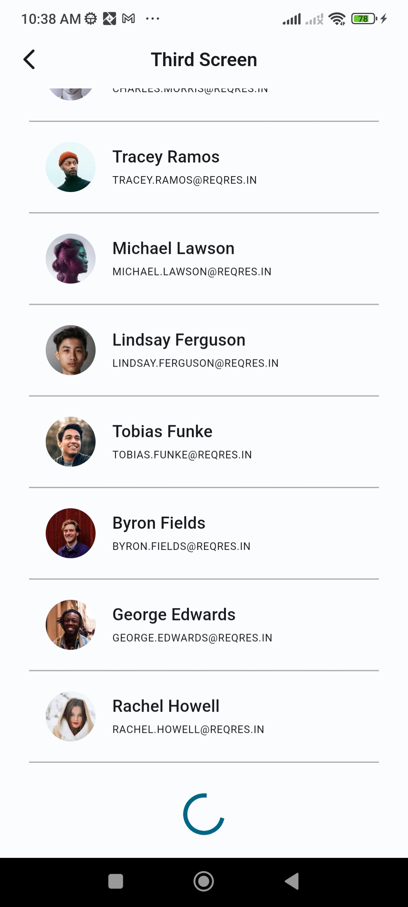

# Suitmedia Application Test

The **Suitmedia Application Test** is an application intended for submission as part of the **Suitmedia Mobile Development Intern Application Test** for **Kampus Merdeka Batch 6**. This application has been developed using:

- Flutter 3.16.3

and has been tested on the following devices:

* Google Pixel 7 Pro (emulator device)
* Xiaomi POCO F4 (physical device)
* Sony Xperia XA2 Ultra (physical device)

The development environment for this application can be recreated using the following command:

```bash
avdmanager create avd --force --name Pixel_7_Pro --abi google_apis_playstore/x86_64 --package "system-images;android-34;google_apis_playstore;x86_64" --device 30
```

## 1 How to run this project

Clone the repository:

```bash
git clone git@github.com:fzl-22/suitmedia-application-test.git
```

Navigate to the cloned repository:

```bash
cd suitmedia-application-test
```

Install required dependencies:

```bash
flutter pub get
```

Make sure to connect to the Android device, then run the project:

```bash
flutter run
```

## 2 How to build this project

To build this application in release mode, run this following command:

```bash
flutter build apk --release
```

When the build completed, the release apk can be located at [build/app/outputs/flutter-apk/app-release.apk](build/app/outputs/flutter-apk/app-release.apk).

The application is ready to be installed on physical device.

Or, the release apk can be downloaded [here](https://github.com/fzl-22/suitmedia-application-test/releases).

## 3 Screenshots

The screenshots of the applications is provided according to the application flow.

### 3.1 First Screen


### 3.2 First Screen - Palindrome Input - "step on no pets"


### 3.3 First Screen - Palindrome Result - "step in no pets"


### 3.4 First Screen - Palindrome Input - "suitmedia"


### 3.5 First Screen - Palindrome Result - "suitmedia"


### 3.6 First Screen - Name - "John Doe"


### 3.7 Second Screen


### 3.8 Third Screen


### 3.9 Third Screen - Pull to Refresh


### 3.10 Third Screen - Infinite Scroll Pagination



### 3.11 Third Screen - Network Error


### 3.12 Third Screen - No Data Fetched


### 3.13 Third Screen - Network Error on Bottom Loading 


### 3.14 Second Screen - Selected User


### 3.15 Miscellaneous

These 2 screenshots show the validation if the button is pressed but the related input field input field is empty.


